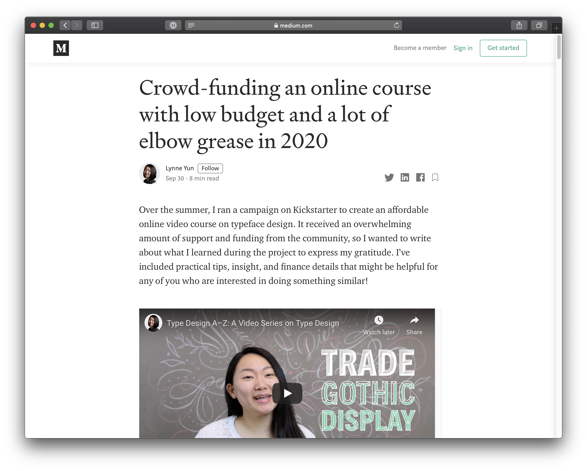
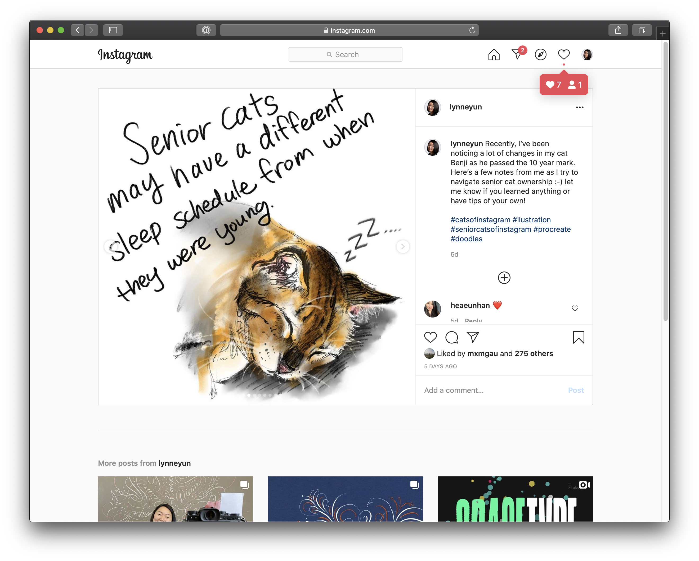

# Assignment E

This past week, I created educational content for two very different subjects. Here is the summary of each project and the feedback that I received:

## The first was ***[Advice for Crowd-Funding an Online Course](https://medium.com/@lynne_22098/crowd-funding-an-online-course-with-low-budget-and-a-lot-of-elbow-grease-in-2020-809f08f509df)***, written as a Medium post with text and image. 

* **What worked well** : People liked the friendly and casual conversational tone of the article, and enjoyed the anecdotes. They also liked how there was substantial detail on the topic.
* **Could be Improved** : Some people wanted to know in advance what they would be getting out of the reading (as in having a thesis). Some people wanted more details (e.g. steps for promoting the campaign, more detail/process photos). Others pointed out that some of the image placements (when they wrap around a paragraph) were distracting during reading.
* **Notes**: I posted the Medium article link on social media (Twitter and IG), and a few colleagues reached out to me (via Slack) to say that they learned a lot from the post. Made me think of how social media is perhaps all intertwined somehow. 
* 

## The second was ***[How to Take Care of an Elderly Cat](https://www.instagram.com/p/CFvCbt3hPC8)***, created as a series of images on Instagram.

* **What worked well** : People were generally very happy about the hand-drawn aesthetics, saying that it was fun, personable & relatable. There were comments about the personal story aspect being very likable, and how people liked seeing other people's stories in the comment section. 
* **Could be Improved** : No comments from anyone (wow!)

### Comparison Notes:
It seemed that people expected to get something concrete out of the Medium post, as opposed to being happy with whatever they saw in the Instagram post. I am wondering if this is because Medium seems like a more serious medium, and also because it is more time-consuming to read. Perhaps Instagram is seen as a much more personal platform, and therefore people have less expectations. 

- - - -

## Looking at tool/task pairs of other students:

It was really interesting looking at how others created their educational post/videos. Here are my takeaways for what was helpful for my learning experience that I hadn't considered in my own posts:

* The ones where it had a combination of materials were the easiest to digest in terms of information. 
	* Example 1: Text over video on Patrick's demo for [opening a beer bottle with a lighter](https://www.youtube.com/watch?v=x-jHLnUKadQ&t=38s)
	* Example 2: Gil's audio clips interlaced between videos for [learning how to listen to opera](http://www.gilsperling.com/how-to-listen-to-opera-don-giovanni-an-audio-lecture/)) 

* If I had an existing interest in the topic, I found myself more eager to learn. 
	* Example 1: Dawn's tomato sauce
	* Example 2: Sarah's Brigadeiros recipe

- - - -

## Thinking About Potential Improvements

Looking back at the feedback that I received, I think if I had to pick one of the posts to improve, it would be *Advice for Crowd-Funding an Online Course*. 

**I would have liked to improve the post by:**

* Try to have a centralized point that the learnings can be wrapped around
* Starting off the post with what readers can expect to learn
* Interlacing the text with some GIFs or short videos for highlights and takeaways. (e.g. Setting up equipment, key moments/quotes)